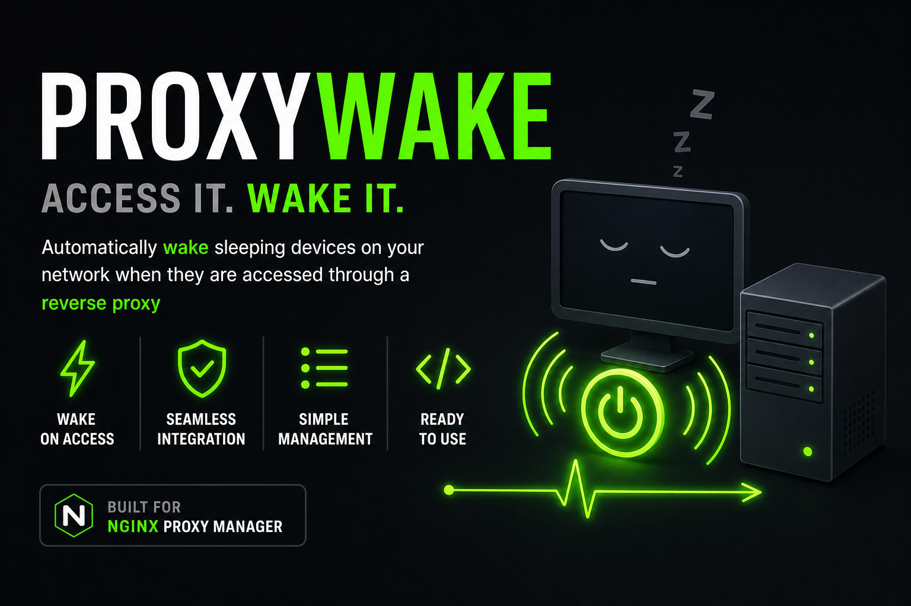
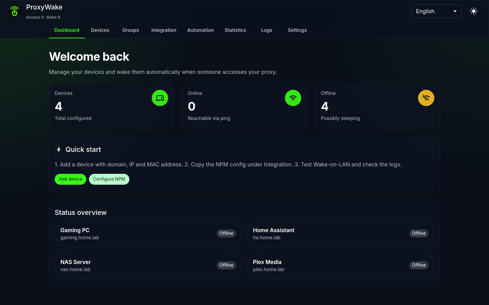
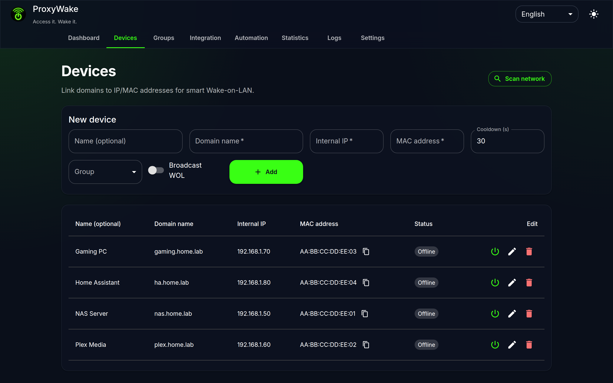
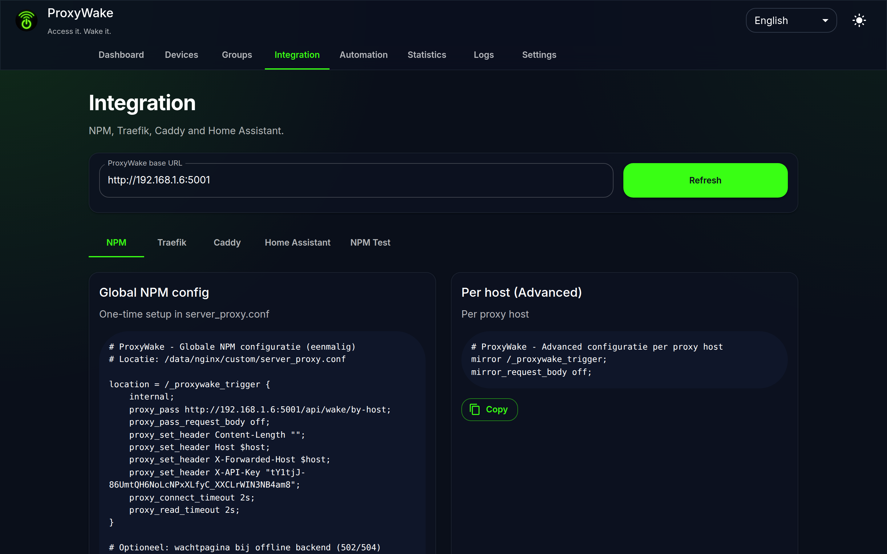
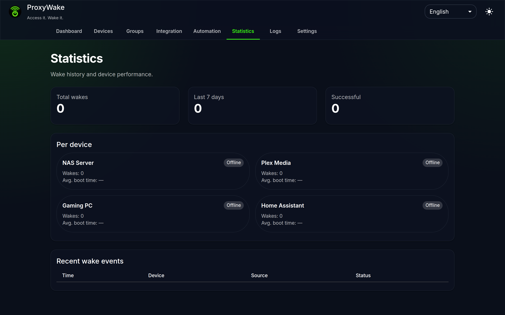
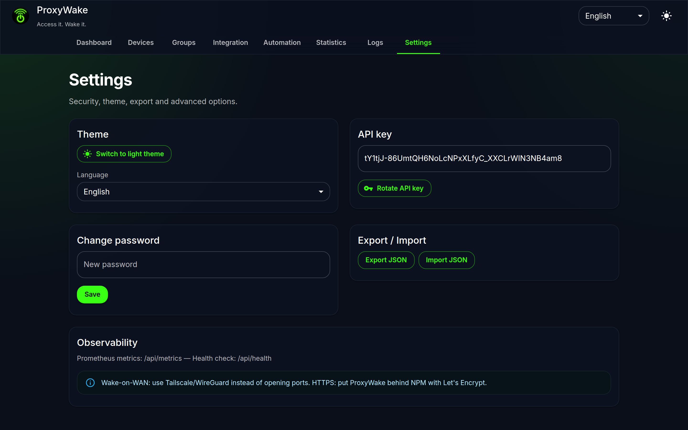
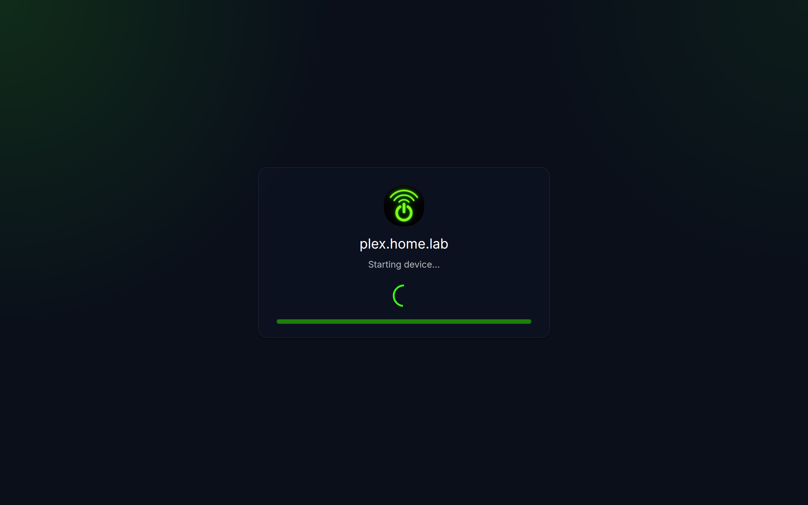

# ProxyWake

<p align="center">
  
</p>

<p align="center">
  <a href="https://hub.docker.com/r/jeffersonmouze/proxywake"></a>
  <a href="https://hub.docker.com/r/jeffersonmouze/proxywake"></a>
  <a href="LICENSE"></a>
  <a href="https://github.com/jeffreymooiweer/ProxyWake/actions"></a>
  
</p>

<p align="center">
  <strong>Access it. Wake it.</strong><br/>
  Wake sleeping devices on your network when they are accessed through a reverse proxy.
</p>

<p align="center">
  <a href="https://hub.docker.com/r/jeffersonmouze/proxywake"><strong>Docker Hub → jeffersonmouze/proxywake</strong></a>
</p>

---

## What it does

1. You register a device (domain, IP, MAC address).
2. Nginx Proxy Manager sends a background wake request when someone visits that domain.
3. ProxyWake sends a Wake-on-LAN magic packet and optionally shows a waiting page until the device is online.

That's it — no need to keep servers running 24/7 just because they might be accessed.

---

## Features

- Wake-on-LAN with smart wake (skip if already online, cooldown, broadcast option)
- Web UI — device management, groups, logs, statistics
- NPM integration snippets (copy & paste)
- Also supports Traefik, Caddy, and Home Assistant
- Waiting page with auto-redirect (`/waiting?domain=...`)
- Webhooks, scheduled wake, export/import
- Password protection, API key auth, audit log

---

## Screenshots

<p align="center">
  
  <br />
  <sub><strong>Dashboard</strong> — device overview, status cards and quick start</sub>
</p>

<table align="center">
  <tr>
    <td width="50%" align="center" valign="top">
      
      <br />
      <sub><strong>Devices</strong> — link domains to IP/MAC addresses</sub>
    </td>
    <td width="50%" align="center" valign="top">
      
      <br />
      <sub><strong>Integration</strong> — copy &amp; paste NPM, Traefik and Caddy configs</sub>
    </td>
  </tr>
  <tr>
    <td width="50%" align="center" valign="top">
      
      <br />
      <sub><strong>Statistics</strong> — wake history and per-device metrics</sub>
    </td>
    <td width="50%" align="center" valign="top">
      
      <br />
      <sub><strong>Settings</strong> — theme, API key, export and security</sub>
    </td>
  </tr>
</table>

<p align="center">
  
  <br />
  <sub><strong>Waiting page</strong> — shown to visitors while a sleeping device wakes up</sub>
</p>

---

## Installation

### Docker Hub (recommended)

Pull the image from Docker Hub and run it:

```bash
docker run -d \
  --name proxywake \
  --restart unless-stopped \
  --cap-add NET_RAW \
  -p 8462:5001 \
  -e PROXYWAKE_PASSWORD=YourSecurePassword \
  -v proxywake_data:/app/backend/data \
  jeffersonmouze/proxywake:latest
```

Open `http://<server-ip>:8462` — a setup wizard walks you through the initial configuration.

**Docker Compose:**

```bash
curl -O https://raw.githubusercontent.com/jeffreymooiweer/ProxyWake/main/docker-compose.yml
PROXYWAKE_PASSWORD=YourSecurePassword docker compose up -d
```

### Build locally

```bash
git clone https://github.com/jeffreymooiweer/ProxyWake.git
cd ProxyWake/docker
cp .env.example .env   # edit password
docker compose up -d --build
```

---

## Docker Hub

| | |
|---|---|
| **Image** | [`jeffersonmouze/proxywake`](https://hub.docker.com/r/jeffersonmouze/proxywake) |
| **Tags** | `latest`, `3.0`, `3.0.0` |
| **Architectures** | `linux/amd64`, `linux/arm64` |

### Unraid

| Setting | Value |
|---------|-------|
| Repository | `jeffersonmouze/proxywake:latest` |
| Port | `8462:5001` |
| Extra Parameters | `--cap-add=NET_RAW` |
| Variable | `PROXYWAKE_PASSWORD` |
| Path | `/mnt/user/appdata/proxywake` → `/app/backend/data` |

---

## Nginx Proxy Manager

After starting ProxyWake:

1. Open the **Integration** tab in the UI.
2. Copy the **global config** into NPM (`server_proxy.conf`).
3. Add the **per-host snippet** under Advanced for each proxy host.
4. Test from the UI.

ProxyWake must be reachable from your NPM container on the local network (use the host IP, not `localhost`).

---

## Environment variables

| Variable | Description |
|----------|-------------|
| `PROXYWAKE_PASSWORD` | Web UI password (recommended) |
| `PROXYWAKE_API_KEY` | Fixed API key for NPM (auto-generated if unset) |
| `PROXYWAKE_SECRET_KEY` | Flask session secret |
| `PROXYWAKE_ALLOWED_ORIGINS` | CORS origins (comma-separated) |
| `PROXYWAKE_DATA_DIR` | Data directory (default: `/app/backend/data`) |

---

## License

MIT — see [LICENSE](LICENSE).
