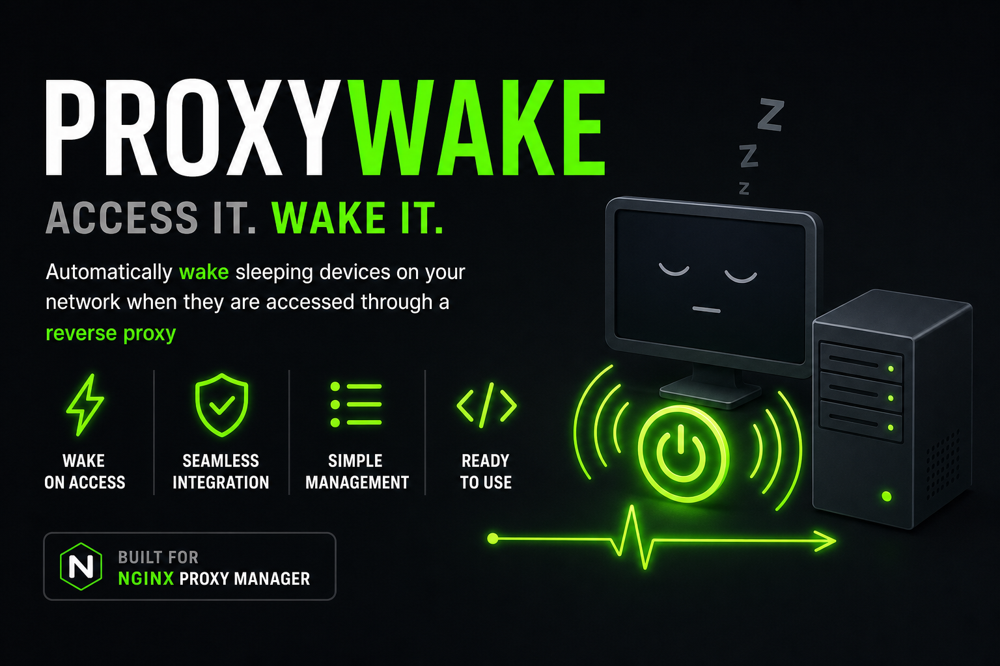
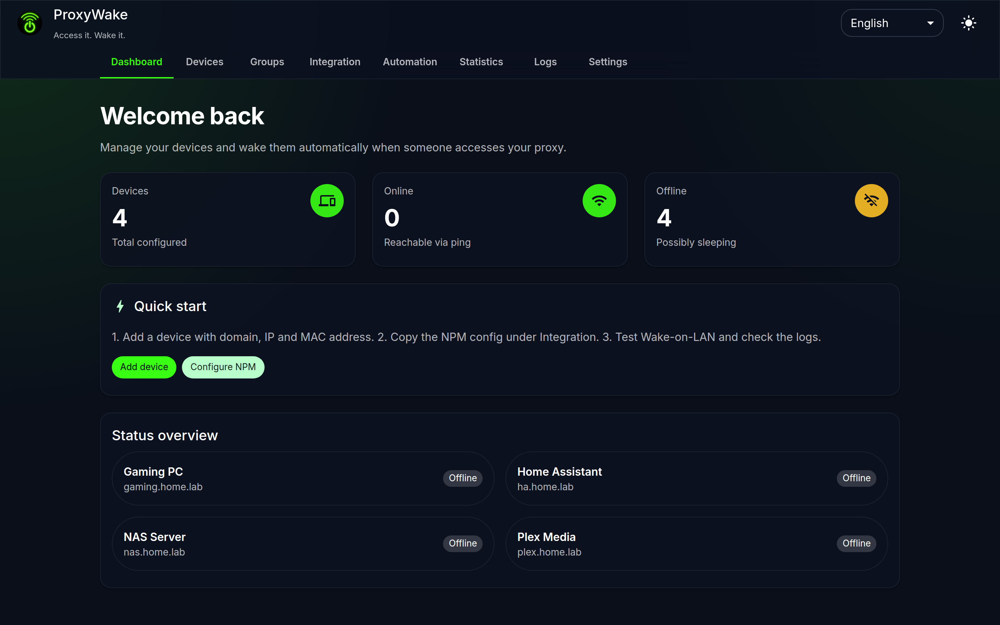
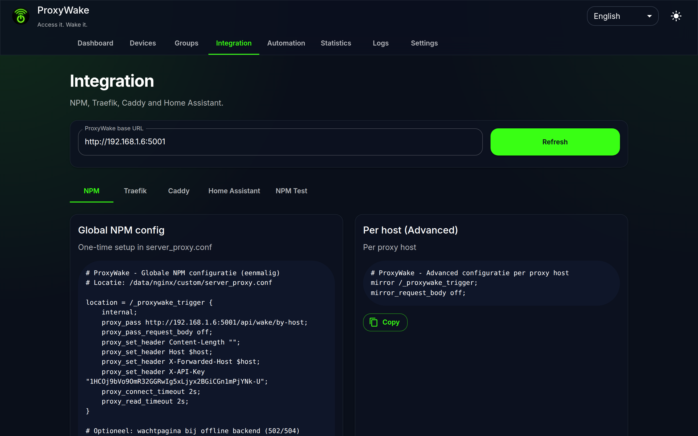

# ProxyWake

<p align="center">
  
</p>

<p align="center">
  <a href="https://hub.docker.com/r/jeffersonmouze/proxywake"></a>
  <a href="https://hub.docker.com/r/jeffersonmouze/proxywake"></a>
  <a href="LICENSE"></a>
  
</p>

<p align="center">
  <strong>Access it. Wake it.</strong><br/>
  Let your servers sleep. ProxyWake turns them on the moment someone actually needs them.
</p>

<p align="center">
  <a href="https://hub.docker.com/r/jeffersonmouze/proxywake"><strong>Docker Hub → jeffersonmouze/proxywake</strong></a>
</p>

---

## What is ProxyWake?

Many home servers run 24/7 even though they are only used a few hours a day, just so they are there when you open `plex.myhome.net` or `nas.myhome.net`. ProxyWake lets you switch them off (or put them to sleep) and still have them available on demand:

1. **You register a device** in ProxyWake: its domain name, IP address and MAC address.
2. **Your reverse proxy** (Nginx Proxy Manager, Traefik or Caddy) tells ProxyWake whenever someone visits that domain.
3. **ProxyWake wakes the device** — with Wake-on-LAN, or via SSH, a webhook, Home Assistant or IPMI — and can show a friendly "waking up…" page until it is online.

You keep the convenience of always-on services with the electricity bill of a server that is off most of the time.

---

## Quick start (5 minutes)

**Requirements:** a Linux machine with Docker (a NAS, Unraid, a Raspberry Pi, a mini PC…) on the same network as the devices you want to wake, and Wake-on-LAN enabled on those devices.

```bash
docker run -d \
  --name proxywake \
  --restart unless-stopped \
  --network host \
  --cap-add NET_RAW \
  -e PROXYWAKE_PASSWORD=ChooseAStrongPassword \
  -e TZ=Europe/Amsterdam \
  -v proxywake_data:/app/backend/data \
  jeffersonmouze/proxywake:latest
```

Then open **`http://<ip-of-that-machine>:5001`** and follow the setup wizard.

> **Why `--network host`?** Wake-on-LAN works by shouting a "magic packet" to everyone on your local network. A container on Docker's default network is on a private network of its own, so its shout never reaches your devices. Host networking puts ProxyWake directly on your LAN. Prefer a dedicated IP for the container instead? Use a macvlan network (`docker-compose.macvlan.yml`, or *Custom: br0* on Unraid). [More about this →](docs/docker.md#networking-and-wake-on-lan)

**Next:** add a device under **Devices**, press the ⏻ button to test that it wakes, then copy the snippet for your proxy from the **Integration** tab. Step-by-step walkthrough: **[docs/quick-start.md](docs/quick-start.md)**.

| How do you want to install? | Guide |
|-----------------------------|-------|
| Docker Compose | [docs/docker.md](docs/docker.md) |
| Unraid (Community Applications) | [docs/unraid.md](docs/unraid.md) |
| Settings and environment variables | [docs/configuration.md](docs/configuration.md) |

Image: [`jeffersonmouze/proxywake`](https://hub.docker.com/r/jeffersonmouze/proxywake) — tags `latest`, `4.4`, `4.4.0` · amd64 & arm64

---

## Connect your reverse proxy

ProxyWake generates ready-to-paste configuration for each proxy under **Integration**. All of them work with the proxy's built-in features — no plugins needed.

| Proxy | How it triggers a wake | Guide |
|-------|------------------------|-------|
| Nginx Proxy Manager | `mirror` sends a copy of each request to ProxyWake | [docs/examples/nginx-proxy-manager.md](docs/examples/nginx-proxy-manager.md) |
| Traefik | built-in `forwardAuth` middleware | [docs/examples/traefik.md](docs/examples/traefik.md) |
| Caddy | built-in `forward_auth` + `handle_errors` | [docs/examples/caddy.md](docs/examples/caddy.md) |
| Home Assistant | REST switch calling the ProxyWake API | [docs/examples/home-assistant.md](docs/examples/home-assistant.md) |

How the pieces fit together: [docs/reverse-proxy.md](docs/reverse-proxy.md).

---

## Features

- **Five wake methods:** Wake-on-LAN, SSH command, HTTP webhook, Home Assistant webhook, IPMI.
- **Smart waking:** skips devices that are already online, respects a cooldown, and can wake dependencies first (e.g. the NAS before the media server).
- **Waiting page:** visitors see a progress page and are sent to the service as soon as it responds.
- **Scheduled wakes:** wake devices at fixed times on chosen weekdays.
- **Groups:** wake several devices with one click or one API call.
- **Notifications:** webhooks (Discord, ntfy, …), Slack and Telegram on wake success or failure.
- **Statistics and logs:** wake history, average boot times, audit trail, live application log.
- **Backup and restore**, **network scanner**, **REST API** with scoped keys and OpenAPI docs, **15 UI languages**.

<p align="center">
  
</p>

<p align="center">
  
</p>

---

## Documentation

| Topic | Link |
|-------|------|
| **Start here** | [docs/quick-start.md](docs/quick-start.md) |
| All guides | [docs/README.md](docs/README.md) |
| Something not working? | [docs/troubleshooting.md](docs/troubleshooting.md) |
| Changelog | [CHANGELOG.md](CHANGELOG.md) |

API reference while ProxyWake is running: `http://<ip>:5001/api/docs`

---

## License

MIT — see [LICENSE](LICENSE).
