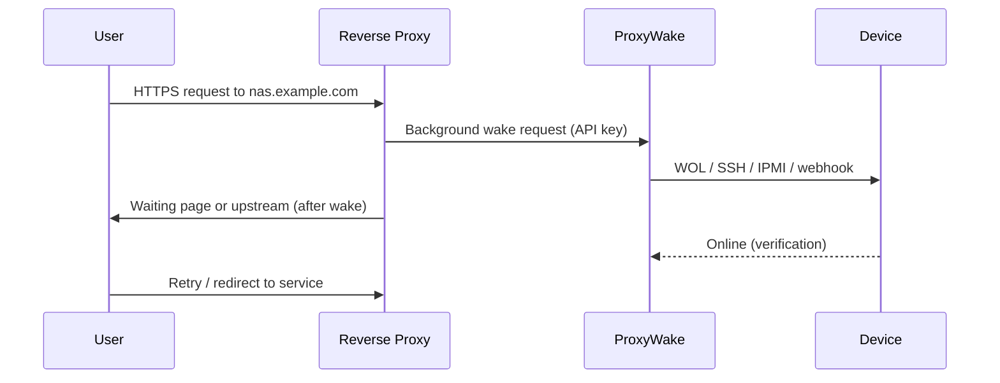

# Reverse Proxy Integration

How ProxyWake fits into wake-on-access workflows with Nginx Proxy Manager, Traefik, Caddy, and Home Assistant.

## How it works

1. A visitor opens a proxied domain.
2. The proxy sends a **non-blocking** wake request to ProxyWake.
3. ProxyWake wakes the device and may show a waiting page.
4. When the device is online, traffic reaches the upstream service.

## Setup

1. Deploy ProxyWake ([Quick Start](quick-start.md)).
2. Register each device with the **exact** proxy hostname.
3. Copy snippets from the **Integration** tab.
4. Apply global + per-host configuration in your proxy.
5. Test with the device powered off.

ProxyWake must be reachable from the proxy on your LAN. Use the **host IP**, not `localhost`.

## Guides

| Proxy | Guide |
|-------|-------|
| Nginx Proxy Manager | [examples/nginx-proxy-manager.md](examples/nginx-proxy-manager.md) |
| Traefik | [examples/traefik.md](examples/traefik.md) |
| Caddy | [examples/caddy.md](examples/caddy.md) |
| Home Assistant | [examples/home-assistant.md](examples/home-assistant.md) |

## Waiting page

Visitors can be redirected to `/waiting?domain=<hostname>` while a device boots. Snippets in the Integration tab handle this per proxy.

## Common mistakes

- Domain in ProxyWake does not match the proxy hostname.
- API key missing `wake` scope.
- ProxyWake URL points to `127.0.0.1` from inside another container.

## See also

- [Configuration](configuration.md)
- [Troubleshooting](troubleshooting.md)
