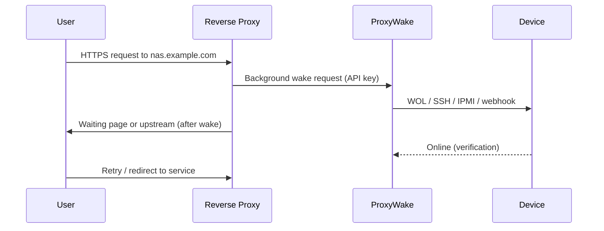

# Reverse Proxy Integration

How ProxyWake fits into reverse-proxy wake-on-access workflows.

## Purpose

Explain the request flow when a visitor accesses a sleeping device through a reverse proxy, and how ProxyWake is triggered in the background.

## Requirements

- ProxyWake reachable from the reverse proxy on your LAN
- Device registered with matching domain name
- API key with `wake` scope (default for NPM snippets)

## How it works



1. User visits a proxied domain.
2. The proxy fires a **non-blocking** wake request to ProxyWake.
3. ProxyWake sends the configured wake method and optionally shows a waiting page.
4. When the device is online, traffic flows to the upstream service.

## Step-by-step

1. Deploy ProxyWake ([Quick Start](quick-start.md)).
2. Register each device with the **exact** proxy hostname.
3. Copy integration snippets from the **Integration** tab.
4. Apply global + per-host configuration in your proxy.
5. Test with the device powered off.

## Supported proxies

| Proxy | Guide |
|-------|-------|
| Nginx Proxy Manager | [examples/nginx-proxy-manager.md](examples/nginx-proxy-manager.md) |
| Traefik | [examples/traefik.md](examples/traefik.md) |
| Caddy | [examples/caddy.md](examples/caddy.md) |
| Home Assistant | [examples/home-assistant.md](examples/home-assistant.md) |

Snippets are generated in the UI with your current API key and ProxyWake URL.

## Waiting page

Public route: `/waiting?domain=<hostname>`

Used when the proxy redirects visitors while the device boots. Polls `GET /api/public/status/<domain>` (rate limited).

## Examples

**ProxyWake URL for Docker on host:**

```
http://192.168.1.10:8462
```

**Per-host NPM snippet:** Generated per device in Integration → NPM.

## Common mistakes

- Wake request blocks the proxy request — use background/`auth_request` patterns from the UI snippets.
- Domain typo — `nas.home` vs `nas.home.lab` must match exactly.
- ProxyWake only on `127.0.0.1` — other containers cannot reach it.

## Related pages

- [API](api.md) — public vs authenticated endpoints
- [Security](security.md) — rate limits and exposure
- [Troubleshooting](troubleshooting.md)
