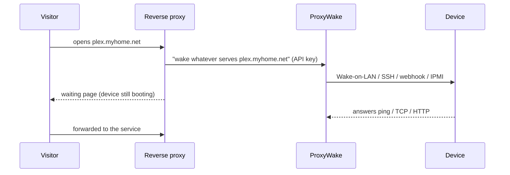

# How wake-on-access works

The idea behind ProxyWake, and what the pieces do.

## The problem

You have a media server, a NAS or a game server that you reach through a nice hostname like `plex.myhome.net`, handled by a reverse proxy such as Nginx Proxy Manager, Traefik or Caddy. To be reachable, the machine has to stay on all day — even when nobody uses it.

## The idea

Let the machine sleep. The reverse proxy is always on anyway (it is small and cheap to run). Teach it to tell ProxyWake "someone wants `plex.myhome.net`", and let ProxyWake switch the machine on.

```mermaid
sequenceDiagram
    participant Visitor
    participant Proxy as Reverse proxy
    participant PW as ProxyWake
    participant Device

    Visitor->>Proxy: opens plex.myhome.net
    Proxy->>PW: "wake whatever serves plex.myhome.net" (API key)
    PW->>Device: Wake-on-LAN / SSH / webhook / IPMI
    Proxy-->>Visitor: waiting page (device still booting)
    Device-->>PW: answers ping / TCP / HTTP
    Visitor->>Proxy: forwarded to the service
```

1. A visitor opens a proxied domain.
2. The proxy sends a small request to ProxyWake's `/api/wake/by-host` endpoint, including the domain and the API key. This takes milliseconds and happens on every request.
3. ProxyWake looks up the device registered for that domain. If it is already online, nothing happens. If not, it sends the wake signal (respecting the cooldown, and waking dependencies first if configured).
4. While the device boots, the proxy cannot reach it and would normally show an error. Instead it can show the **ProxyWake waiting page**, which polls the device and forwards the visitor automatically once it is up.

## What each proxy uses

None of the integrations need plugins; they use features the proxies already have.

| Proxy | Mechanism | Guide |
|-------|-----------|-------|
| Nginx Proxy Manager | `mirror` sends a copy of each request to ProxyWake; `error_page` redirects to the waiting page on 502/504 | [nginx-proxy-manager.md](examples/nginx-proxy-manager.md) |
| Traefik | `forwardAuth` middleware asks ProxyWake before forwarding each request | [traefik.md](examples/traefik.md) |
| Caddy | `forward_auth` before each request; `handle_errors` redirects to the waiting page | [caddy.md](examples/caddy.md) |
| Home Assistant | A REST switch that calls the ProxyWake API | [home-assistant.md](examples/home-assistant.md) |

## Setting it up

1. Install ProxyWake ([Quick Start](quick-start.md)) with host networking.
2. Add each device with the **exact** hostname your proxy uses for it.
3. Set the **ProxyWake URL** (Settings, or the field at the top of the Integration tab) to an address your proxy can reach — the LAN IP of the ProxyWake machine, e.g. `http://192.168.1.10:5001`. `localhost` only works if the proxy runs on the very same machine *outside* Docker.
4. Copy the snippet from **Integration** into your proxy.
5. Test with the device switched off.

## The waiting page

`http://<proxywake>/waiting?domain=<hostname>` shows a progress page, triggers the wake if needed, checks every few seconds whether the device is online, and then sends the visitor to `https://<hostname>`. The NPM and Caddy snippets redirect to it automatically when the backend is down.

## Common mistakes

- The domain in ProxyWake does not match the proxy hostname exactly.
- The ProxyWake URL in the snippet points to `localhost` or `127.0.0.1` from inside another container.
- ProxyWake runs on Docker's bridge network, so Wake-on-LAN never reaches the LAN — see [Docker → Networking](docker.md#networking-and-wake-on-lan).

## See also

- [Configuration](configuration.md) · [Troubleshooting](troubleshooting.md)
